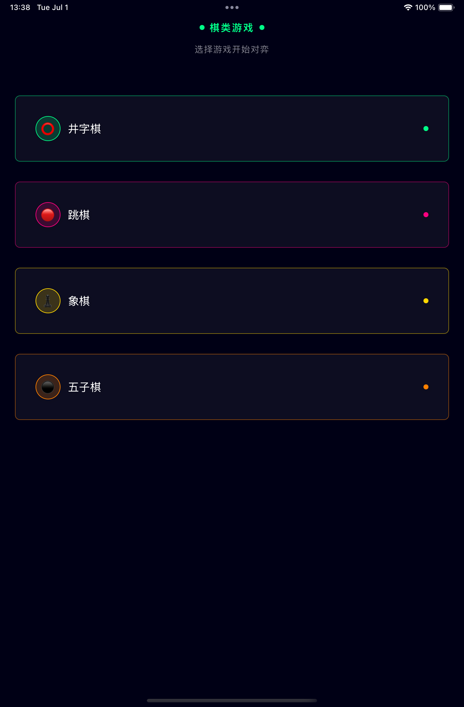
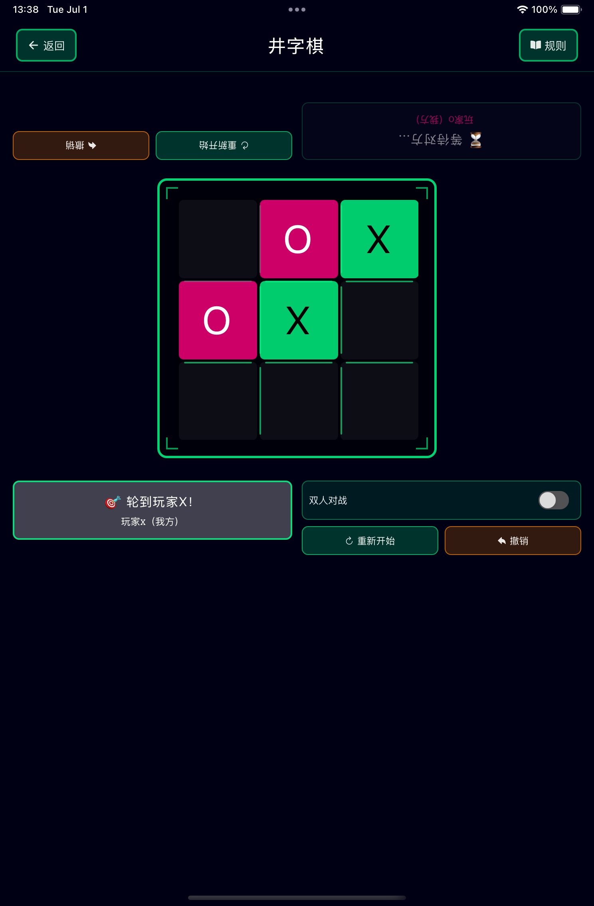
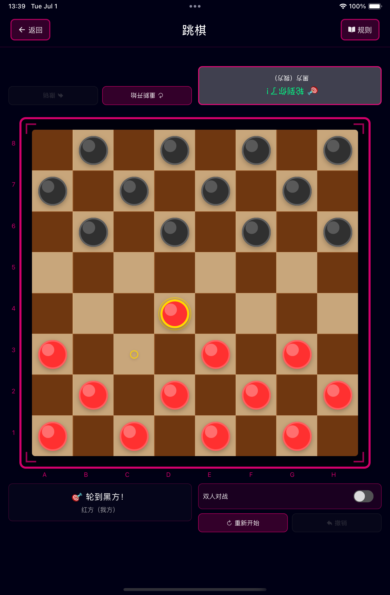
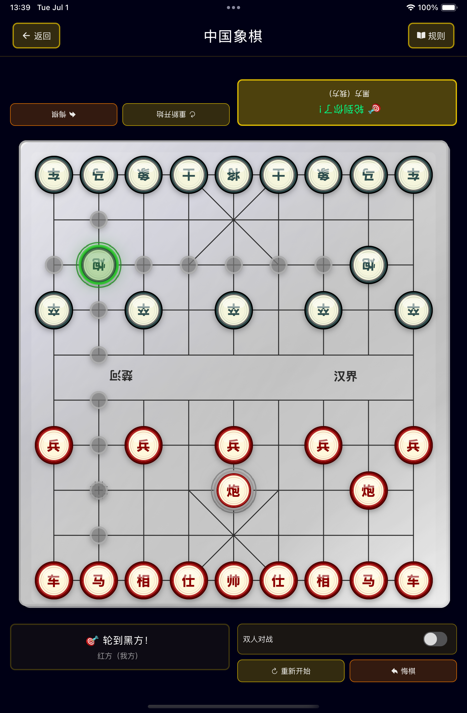
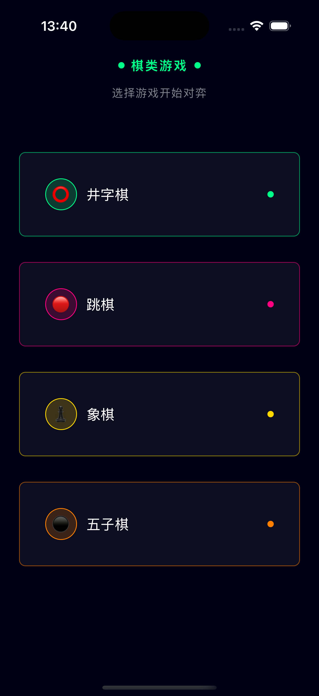
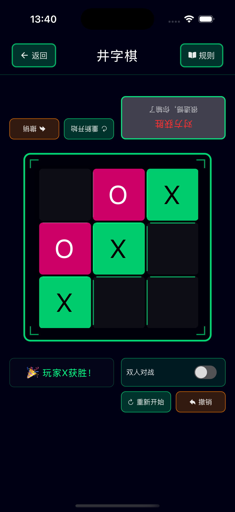
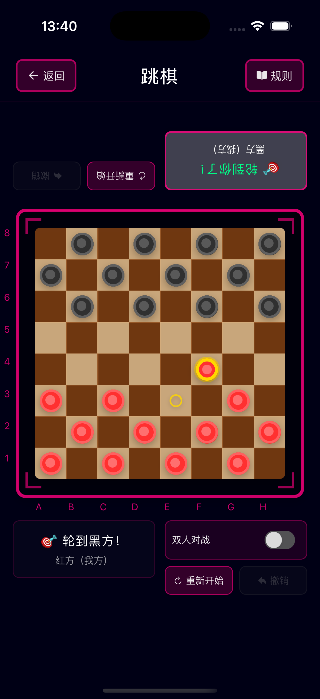
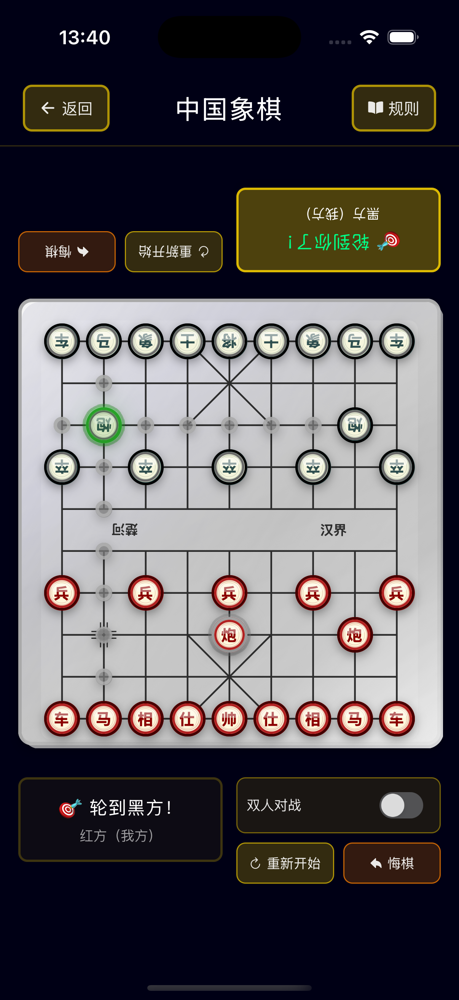
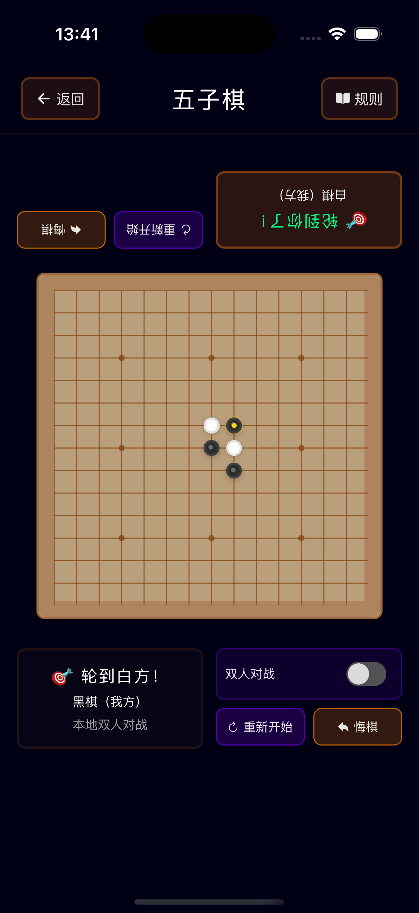

# 棋类游戏 - 经典策略游戏合集

<div align="center">
  
**[English](./README_EN.md) | 中文**

  
</div>

一个专为家庭互动和亲子对弈设计的现代React Native棋类游戏应用。通过科技感十足的未来主义界面，体验经典策略游戏，寓教于乐。

## 🎯 项目特色

- **🏠 亲子友好设计** - 界面简洁直观，适合各年龄段用户
- **🧠 教育性游戏** - 培养逻辑思维、专注力和耐心
- **🎮 多种游戏模式** - 支持AI对战和本地双人对战
- **💾 智能存档系统** - 自动保存游戏进度，支持多档位管理
- **🚀 现代科技界面** - 赛博朋克风格设计，霓虫美学
- **💻 iPad优化** - 针对大屏设备的响应式布局和栅格系统
- **📱 跨平台支持** - iOS、iPad和Android原生性能
- **⚡ 实时游戏体验** - 流畅动画和响应式交互

## 🎮 已实现游戏

### 🔥 井字棋


- ✅ 经典3×3棋盘游戏
- ✅ 智能AI对手策略（简单/中等/困难）
- ✅ 本地双人对战模式
- ✅ 撤销步骤功能
- ✅ 游戏重置选项
- ✅ 胜负平局检测系统
- ✅ 自动存档和游戏恢复

<br clear="right"/>

### 🔴 跳棋


- ✅ 传统8×8棋盘游戏
- ✅ 策略性棋子移动
- ✅ 王棋晋升系统
- ✅ 连续跳跃机制
- ✅ AI难度级别调节
- ✅ 移动合法性验证
- ✅ 游戏状态自动保存

<br clear="right"/>

### ♟️ 象棋


- ✅ 完整中国象棋实现
- ✅ 所有棋子移动规则
- ✅ 将军和将死检测
- ✅ 移动历史记录
- ✅ 高级AI引擎
- ✅ 复盘功能
- ✅ 存档管理系统

<br clear="right"/>

### ⚫ 五子棋


- ✅ 15×15格棋盘
- ✅ 五子连珠获胜
- ✅ 策略型AI对手
- ✅ 灵活棋盘操作
- ✅ 模式识别算法
- ✅ 竞赛规则支持
- ✅ 游戏进度保存

<br clear="right"/>

## 💾 存档系统特性

### 智能自动保存
- **实时保存** - 每步操作后自动保存游戏状态
- **多档管理** - 支持最多5个存档槽位
- **智能命名** - 自动生成带时间戳的存档名称
- **快速恢复** - 一键加载之前的游戏状态

### 存档管理功能
- **存档浏览** - 清晰的存档列表界面
- **时间显示** - 显示存档创建时间
- **模式标识** - 区分AI模式和双人模式
- **存档替换** - 自动管理存档数量限制

## 🎨 全新APP图标

<div align="center">
  
</div>

- **设计理念** - 国际象棋马（骑士）造型，象征智慧与策略
- **视觉风格** - 简洁现代，黑白红蓝配色方案
- **适配完整** - 支持iOS和Android所有尺寸要求
- **品牌识别** - 独特设计便于用户识别和记忆

## 🛠️ 技术栈

- **前端框架**: React Native 0.80
- **UI组件库**: NativeBase 3.4
- **导航系统**: React Navigation 7
- **状态管理**: React Hooks + Context
- **存储方案**: AsyncStorage
- **开发语言**: TypeScript
- **支持平台**: iOS、iPad & Android
- **架构模式**: 组件化架构配合自定义Hooks
- **响应式设计**: 自适应设备检测和尺寸优化

## 📦 主要依赖

```json
{
  "react": "19.1.0",
  "react-native": "0.80.0",
  "@react-navigation/native": "^7.1.14",
  "@react-navigation/stack": "^7.4.2",
  "native-base": "^3.4.28",
  "react-native-vector-icons": "^10.2.0",
  "react-native-modal": "^13.0.1",
  "@react-native-async-storage/async-storage": "^2.2.0",
  "moment": "^2.30.1"
}
```

## 🚀 快速开始

### 环境要求

- Node.js 18+ 
- React Native CLI
- Android Studio（安卓开发）
- Xcode（iOS开发，仅限macOS）

### 安装步骤

1. **克隆仓库**
   ```bash
   git clone <repository-url>
   cd board-games
   ```

2. **安装依赖**
   ```bash
   npm install
   ```

3. **iOS环境配置（仅限macOS）**
   ```bash
   # 安装CocoaPods依赖
   cd ios && pod install && cd ..
   ```

### 运行应用

#### Android
```bash
npm run android
# 或者
npx react-native run-android
```

#### iOS
```bash
npm run ios
# 或者
npx react-native run-ios
```

### 开发脚本

```bash
npm start          # 启动Metro打包器
npm run lint       # 运行ESLint代码检查
npm test          # 运行测试
```

## 🎨 设计理念

应用采用尖端的赛博朋克美学风格：

- **深空黑背景** (`#000015`) - 营造沉浸式科技氛围
- **霓虹绿主色** (`#00ff88`) - 未来主义强调色
- **极简主义布局** - 专注核心功能
- **等宽字体** - 增强编程感觉
- **发光效果** - 阴影和边框营造未来科技氛围
- **响应式设计** - 适配不同屏幕尺寸和方向

## 🏗️ 项目结构

```
src/
├── components/     # 可复用UI组件
│   ├── *Board.tsx     # 各游戏棋盘组件
│   ├── *Controls.tsx  # 游戏控制组件
│   └── SaveGameModal.tsx # 存档管理界面
├── screens/        # 屏幕组件
│   ├── HomeScreen.tsx     # 主屏幕
│   └── *Screen.tsx        # 各游戏屏幕
├── navigation/     # 导航配置
├── hooks/          # 自定义React Hooks
│   ├── use*.ts           # 游戏逻辑hooks
│   └── useSaveGame.ts    # 存档系统hook
├── utils/          # 游戏逻辑和工具函数
│   ├── deviceUtils.ts    # 设备检测和响应式工具
│   ├── saveUtils.ts      # 存档管理工具
│   ├── gameLogic.ts      # 游戏逻辑实现
│   └── ...
└── types/          # TypeScript类型定义
```

### 🎯 iPad适配特性

- **智能设备检测** - 自动识别iPad和大屏设备
- **响应式栅格布局** - iPad上游戏卡片采用2-3列网格布局
- **自适应尺寸** - 棋盘、字体、间距根据设备自动调整
- **横竖屏支持** - 全方向支持，优化不同使用场景
- **统一设计语言** - 保持一致的视觉体验

## 🔧 技术亮点

### 性能优化
- **内存管理** - 组件卸载时自动清理定时器和监听器
- **状态安全** - 防止组件卸载后的状态更新
- **缓存机制** - 智能缓存游戏状态和用户偏好

### 用户体验
- **流畅动画** - 60fps的游戏动画和过渡效果
- **响应式交互** - 即时反馈的触摸交互
- **错误处理** - 优雅的错误恢复和用户提示

### 代码质量
- **TypeScript严格模式** - 完整的类型安全
- **组件化设计** - 高度可复用的模块化架构
- **测试覆盖** - 单元测试和集成测试

## 🧪 测试

运行测试套件：

```bash
npm test
```

## 📱 应用截图

### iPad体验
针对平板设备优化，采用响应式网格布局和增强的触控区域。

| 主屏幕 | 井字棋 | 跳棋 | 象棋 | 五子棋 |
|--------|--------|------|------|--------|
|  |  |  |  |  |

### iPhone体验
专为移动设备优化的紧凑设计。

| 主屏幕 | 井字棋 | 跳棋 | 象棋 | 五子棋 |
|--------|--------|------|------|--------|
|  |  |  |  |  |

## 🤝 贡献指南

1. Fork本仓库
2. 创建功能分支 (`git checkout -b feature/amazing-feature`)
3. 提交修改 (`git commit -m 'Add amazing feature'`)
4. 推送到分支 (`git push origin feature/amazing-feature`)
5. 创建Pull Request

## 📄 开源协议

本项目采用[MIT开源协议](LICENSE)。

## 🌟 未来计划

- 🔮 在线多人对战支持
- 🏆 成就系统和排行榜
- 📊 游戏统计和分析面板
- 🎵 音效和背景音乐系统
- 🌍 多语言国际化支持
- 🎯 教程和训练模式
- 🔐 云端存档同步
- 📱 Apple Watch/智能手表支持

---

<div align="center">
  <b>🎮 享受现代风格的经典棋类游戏！🚀</b>
  <br/>
  <br/>
  
  
  
</div>
