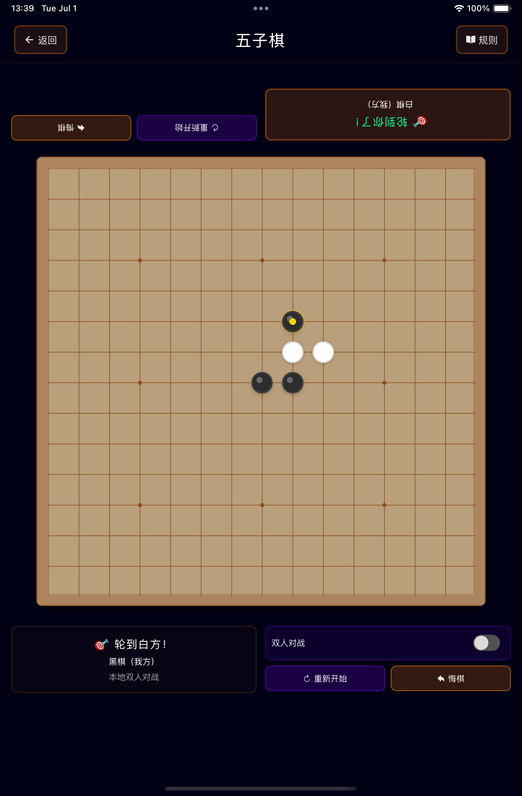

# 棋类游戏 - 经典策略游戏合集

<div align="center">
  
**[English](./README_EN.md) | 中文**

  
</div>

一个专为家庭互动和亲子对弈设计的现代React Native棋类游戏应用。通过科技感十足的未来主义界面，体验经典策略游戏，寓教于乐。

## 🎯 项目特色

- **🏠 亲子友好设计** - 界面简洁直观，适合各年龄段用户
- **🧠 教育性游戏** - 培养逻辑思维、专注力和耐心
- **🎮 多种游戏模式** - 支持AI对战和本地双人对战
- **🚀 现代科技界面** - 赛博朋克风格设计，霓虹美学
- **💻 iPad优化** - 针对大屏设备的响应式布局和栅格系统
- **📱 跨平台支持** - iOS、iPad和Android原生性能
- **⚡ 实时游戏体验** - 流畅动画和响应式交互

## 🎮 已实现游戏

### 🔥 井字棋


- ✅ 经典3×3棋盘游戏
- ✅ 智能AI对手策略
- ✅ 本地双人对战模式
- ✅ 撤销步骤功能
- ✅ 游戏重置选项
- ✅ 胜负平局检测系统

<br clear="right"/>

### 🔴 跳棋


- ✅ 传统8×8棋盘游戏
- ✅ 策略性棋子移动
- ✅ 王棋晋升系统
- ✅ 吃子机制
- ✅ AI难度级别
- ✅ 移动合法性验证

<br clear="right"/>

### ♟️ 象棋


- ✅ 完整象棋实现
- ✅ 所有棋子移动规则
- ✅ 王车易位和过路兵
- ✅ 将军和将死检测
- ✅ 移动历史记录
- ✅ 高级AI引擎

<br clear="right"/>

### ⚫ 五子棋


- ✅ 15×15格棋盘
- ✅ 五子连珠获胜
- ✅ 策略型AI对手
- ✅ 灵活棋盘尺寸
- ✅ 模式识别算法
- ✅ 竞赛规则支持

<br clear="right"/>

## 🛠️ 技术栈

- **前端框架**: React Native 0.80
- **UI组件库**: NativeBase 3.4
- **导航系统**: React Navigation 7
- **状态管理**: React Hooks
- **开发语言**: TypeScript
- **支持平台**: iOS、iPad & Android
- **架构模式**: 组件化架构配合自定义Hooks
- **响应式设计**: 自适应设备检测和尺寸优化

## 📦 主要依赖

```json
{
  "react": "19.1.0",
  "react-native": "0.80.0",
  "@react-navigation/native": "^7.1.14",
  "native-base": "^3.4.28",
  "react-native-vector-icons": "^10.2.0",
  "react-native-sound": "^0.11.2"
}
```

## 🚀 快速开始

### 环境要求

- Node.js 18+ 
- React Native CLI
- Android Studio（安卓开发）
- Xcode（iOS开发，仅限macOS）

### 安装步骤

1. **克隆仓库**
   ```bash
   git clone <repository-url>
   cd board-games
   ```

2. **安装依赖**
   ```bash
   npm install
   ```

3. **iOS环境配置（仅限macOS）**
   ```bash
   # 安装CocoaPods依赖
   bundle install
   bundle exec pod install
   ```

### 运行应用

#### Android
```bash
npm run android
# 或者
npx react-native run-android
```

#### iOS
```bash
npm run ios
# 或者
npx react-native run-ios
```

### 开发脚本

```bash
npm start          # 启动Metro打包器
npm run lint       # 运行ESLint代码检查
npm test          # 运行测试
```

## 🎨 设计理念

应用采用尖端的赛博朋克美学风格：

- **深空黑背景** (`#000015`) - 营造沉浸式科技氛围
- **霓虹绿主色** (`#00ff88`) - 未来主义强调色
- **极简主义布局** - 专注核心功能
- **等宽字体** - 增强编程感觉
- **发光效果** - 阴影和边框营造未来科技氛围

## 🏗️ 项目结构

```
src/
├── components/     # 可复用UI组件
├── screens/        # 屏幕组件
├── navigation/     # 导航配置
├── hooks/          # 自定义React Hooks
├── utils/          # 游戏逻辑和工具函数
│   ├── deviceUtils.ts    # 设备检测和响应式工具
│   └── ...
└── types/          # TypeScript类型定义
```

### 🎯 iPad适配特性

- **智能设备检测** - 自动识别iPad和大屏设备
- **响应式栅格布局** - iPad上游戏卡片采用2-3列网格布局
- **自适应尺寸** - 棋盘、字体、间距根据设备自动调整
- **横竖屏支持** - 全方向支持，优化不同使用场景
- **统一设计语言** - 保持一致的视觉体验

## 🧪 测试

运行测试套件：

```bash
npm test
```

## 📱 应用截图

### iPad体验
针对平板设备优化，采用响应式网格布局和增强的触控区域。

| 主屏幕 | 井字棋 | 跳棋 | 象棋 | 五子棋 |
|--------|--------|------|------|--------|
|  |  |  |  |  |

### iPhone体验
专为移动设备优化的紧凑设计。

| 主屏幕 | 井字棋 | 跳棋 | 象棋 | 五子棋 |
|--------|--------|------|------|--------|
|  |  |  |  |  |

## 🤝 贡献指南

1. Fork本仓库
2. 创建功能分支 (`git checkout -b feature/amazing-feature`)
3. 提交修改 (`git commit -m 'Add amazing feature'`)
4. 推送到分支 (`git push origin feature/amazing-feature`)
5. 创建Pull Request

## 📄 开源协议

本项目采用[MIT开源协议](LICENSE)。

## 🌟 未来计划

- 🔮 在线多人对战支持
- 🏆 成就系统
- 📊 游戏统计和分析
- 🎵 音效和背景音乐
- 🌍 多语言支持
- 🎯 教程和训练模式

---

<div align="center">
  <b>🎮 享受现代风格的经典棋类游戏！🚀</b>
</div>
