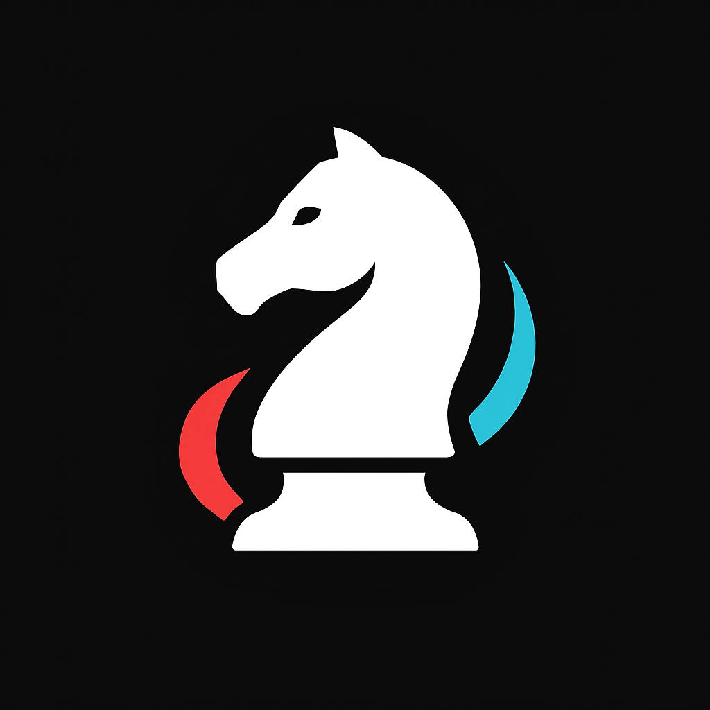
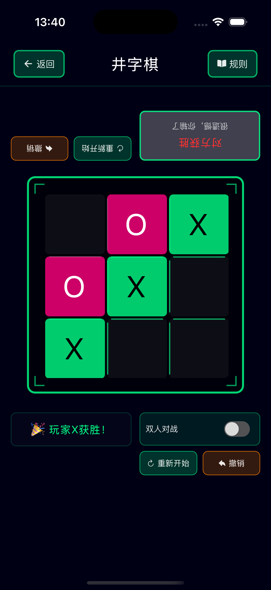
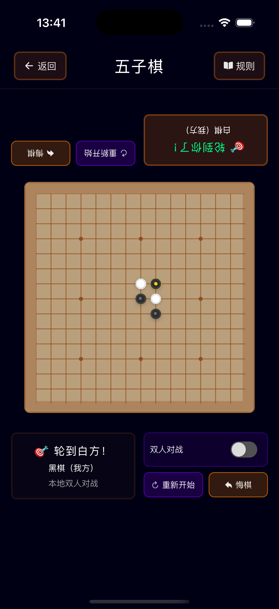

# Board Games - Classic Strategy Games Collection

<div align="center">
  
**English | [中文](./README.md)**

  
</div>

A modern React Native board games application designed for family bonding and interactive gameplay. Experience classic strategy games with a futuristic tech-style interface that combines entertainment with educational value.

## 🎯 Project Features

- **🏠 Family-Friendly Design** - Clean, intuitive interface suitable for all ages
- **🧠 Educational Gaming** - Develops logical thinking, concentration, and patience
- **🎮 Multiple Game Modes** - AI opponents and local multiplayer support
- **💾 Smart Save System** - Auto-save game progress with multi-slot management
- **🚀 Modern Tech UI** - Cyberpunk-inspired design with neon aesthetics
- **📱 Cross-Platform** - Native performance on iOS, iPad and Android
- **💻 iPad Optimized** - Responsive grid layout and adaptive sizing for tablets
- **⚡ Real-time Gameplay** - Smooth animations and responsive interactions

## 🎮 Available Games

### 🔥 Tic-Tac-Toe


- ✅ Classic 3×3 grid gameplay
- ✅ AI opponent with smart strategy (Easy/Medium/Hard)
- ✅ Local multiplayer mode
- ✅ Undo move functionality
- ✅ Game reset option
- ✅ Win/draw detection system
- ✅ Auto-save and game restoration

<br clear="right"/>

### 🔴 Checkers


- ✅ Traditional 8×8 board game
- ✅ Strategic piece movement
- ✅ King promotion system
- ✅ Multiple jump capture mechanics
- ✅ AI difficulty level adjustment
- ✅ Move validation system
- ✅ Automatic game state saving

<br clear="right"/>

### ♟️ Chess


- ✅ Full Chinese Chess implementation
- ✅ All piece movement rules
- ✅ Check and checkmate detection
- ✅ Move history tracking
- ✅ Advanced AI engine
- ✅ Game replay functionality
- ✅ Save management system

<br clear="right"/>

### ⚫ Gomoku (Five in a Row)


- ✅ 15×15 grid board
- ✅ Five-in-a-row victory condition
- ✅ Strategic AI opponent
- ✅ Flexible board interactions
- ✅ Pattern recognition algorithms
- ✅ Tournament rules support
- ✅ Game progress saving

<br clear="right"/>

## 💾 Save System Features

### Smart Auto-Save
- **Real-time Saving** - Automatically saves game state after each move
- **Multi-slot Management** - Supports up to 5 save slots per game
- **Smart Naming** - Auto-generates save names with timestamps
- **Quick Restoration** - One-click loading of previous game states

### Save Management
- **Save Browser** - Clean save list interface
- **Time Display** - Shows save creation timestamps
- **Mode Identification** - Distinguishes AI mode vs multiplayer mode
- **Save Replacement** - Automatic save count limit management

## 🎨 Brand New App Icon

<div align="center">
  
</div>

- **Design Concept** - Chess knight (horse) shape, symbolizing wisdom and strategy
- **Visual Style** - Clean modern design with black, white, red and blue color scheme
- **Full Compatibility** - Supports all iOS and Android size requirements
- **Brand Recognition** - Unique design for easy user identification and memorability

## 🛠️ Tech Stack

- **Frontend**: React Native 0.80
- **UI Framework**: NativeBase 3.4
- **Navigation**: React Navigation 7
- **State Management**: React Hooks + Context
- **Storage**: AsyncStorage
- **Language**: TypeScript
- **Platform**: iOS, iPad & Android
- **Architecture**: Component-based with custom hooks
- **Responsive Design**: Adaptive device detection and size optimization

## 📦 Dependencies

```json
{
  "react": "19.1.0",
  "react-native": "0.80.0",
  "@react-navigation/native": "^7.1.14",
  "@react-navigation/stack": "^7.4.2",
  "native-base": "^3.4.28",
  "react-native-vector-icons": "^10.2.0",
  "react-native-modal": "^13.0.1",
  "@react-native-async-storage/async-storage": "^2.2.0",
  "moment": "^2.30.1"
}
```

## 🚀 Getting Started

### Prerequisites

- Node.js 18+ 
- React Native CLI
- Android Studio (for Android)
- Xcode (for iOS, macOS only)

### Installation

1. **Clone the repository**
   ```bash
   git clone <repository-url>
   cd board-games
   ```

2. **Install dependencies**
   ```bash
   npm install
   ```

3. **iOS Setup (macOS only)**
   ```bash
   # Install CocoaPods dependencies
   cd ios && pod install && cd ..
   ```

### Running the App

#### Android
```bash
npm run android
# or
npx react-native run-android
```

#### iOS
```bash
npm run ios
# or
npx react-native run-ios
```

### Development Scripts

```bash
npm start          # Start Metro bundler
npm run lint       # Run ESLint
npm test          # Run tests
```

## 🎨 Design Philosophy

The application features a cutting-edge cyberpunk aesthetic with:

- **Deep Space Black** (`#000015`) - Creating an immersive tech atmosphere
- **Neon Green Primary** (`#00ff88`) - Futuristic accent color
- **Minimalist Layout** - Focus on core functionality
- **Monospace Typography** - Enhanced programming feel
- **Glow Effects** - Shadows and borders for future-tech ambiance
- **Responsive Design** - Adapts to different screen sizes and orientations

## 🏗️ Project Structure

```
src/
├── components/     # Reusable UI components
│   ├── *Board.tsx     # Game board components
│   ├── *Controls.tsx  # Game control components
│   └── SaveGameModal.tsx # Save management interface
├── screens/        # Screen components
│   ├── HomeScreen.tsx     # Main screen
│   └── *Screen.tsx        # Game screens
├── navigation/     # Navigation configuration
├── hooks/          # Custom React hooks
│   ├── use*.ts           # Game logic hooks
│   └── useSaveGame.ts    # Save system hook
├── utils/          # Game logic and utilities
│   ├── deviceUtils.ts    # Device detection and responsive tools
│   ├── saveUtils.ts      # Save management utilities
│   ├── gameLogic.ts      # Game logic implementation
│   └── ...
└── types/          # TypeScript type definitions
```

### 🎯 iPad Optimization Features

- **Smart Device Detection** - Automatically identifies iPad and large screen devices
- **Responsive Grid Layout** - 2-3 column grid layout for game cards on iPad
- **Adaptive Sizing** - Board, fonts, spacing adjust automatically based on device
- **Orientation Support** - Full orientation support optimized for different use cases
- **Unified Design Language** - Consistent visual experience across devices

## 🔧 Technical Highlights

### Performance Optimization
- **Memory Management** - Automatic cleanup of timers and listeners on component unmount
- **State Safety** - Prevents state updates after component unmounting
- **Caching Mechanism** - Smart caching of game states and user preferences

### User Experience
- **Smooth Animations** - 60fps game animations and transitions
- **Responsive Interactions** - Instant feedback for touch interactions
- **Error Handling** - Graceful error recovery and user notifications

### Code Quality
- **TypeScript Strict Mode** - Complete type safety
- **Component Design** - Highly reusable modular architecture
- **Test Coverage** - Unit tests and integration tests

## 🧪 Testing

Run the test suite:

```bash
npm test
```

## 📱 Screenshots Gallery

### iPad Experience
Optimized for tablet devices with responsive grid layout and enhanced touch areas.

| Home Screen | Tic-Tac-Toe | Checkers | Chess | Gomoku |
|-------------|-------------|----------|--------|--------|
|  |  |  |  |  |

### iPhone Experience
Compact design optimized for mobile devices.

| Home Screen | Tic-Tac-Toe | Checkers | Chess | Gomoku |
|-------------|-------------|----------|--------|--------|
|  |  |  |  |  |

## 🤝 Contributing

1. Fork the repository
2. Create a feature branch (`git checkout -b feature/amazing-feature`)
3. Commit your changes (`git commit -m 'Add amazing feature'`)
4. Push to the branch (`git push origin feature/amazing-feature`)
5. Open a Pull Request

## 📄 License

This project is open source and available under the [MIT License](LICENSE).

## 🌟 Future Enhancements

- 🔮 Online multiplayer support
- 🏆 Achievement system and leaderboards
- 📊 Game statistics and analytics dashboard
- 🎵 Sound effects and background music system
- 🌍 Multi-language internationalization support
- 🎯 Tutorial and training modes
- 🔐 Cloud save synchronization
- 📱 Apple Watch/Smart watch support

---

<div align="center">
  <b>🎮 Enjoy playing classic board games with a modern twist! 🚀</b>
  <br/>
  <br/>
  
  
  
</div> 