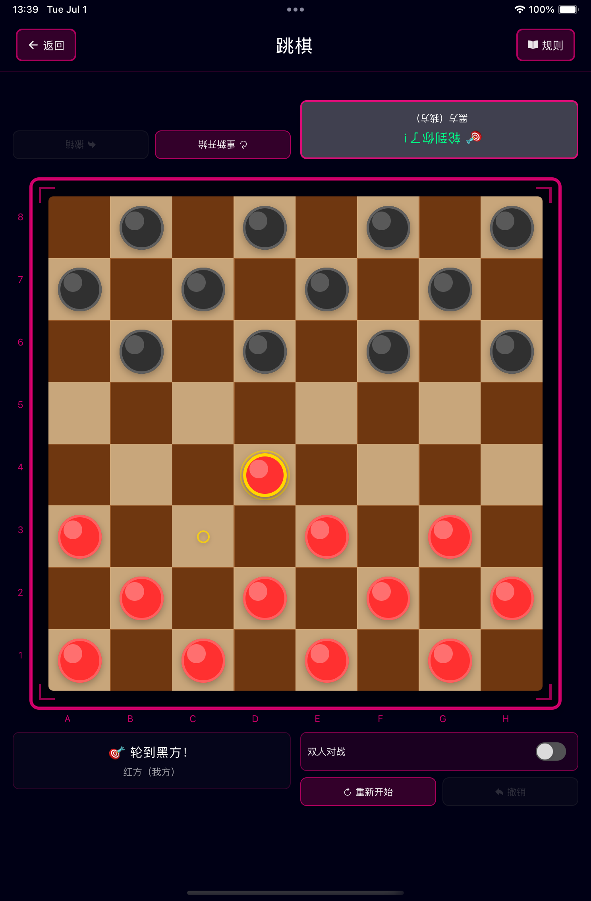
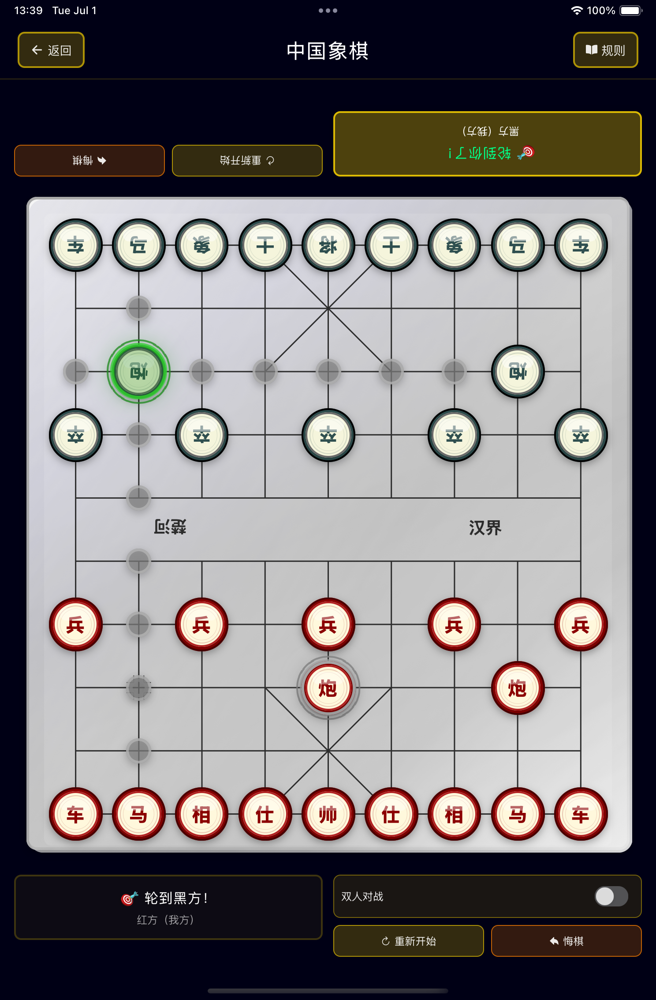
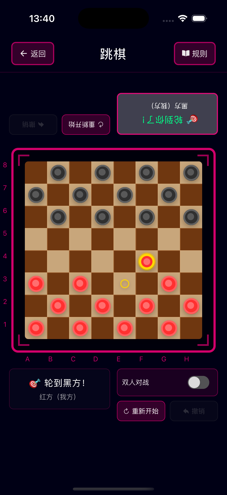
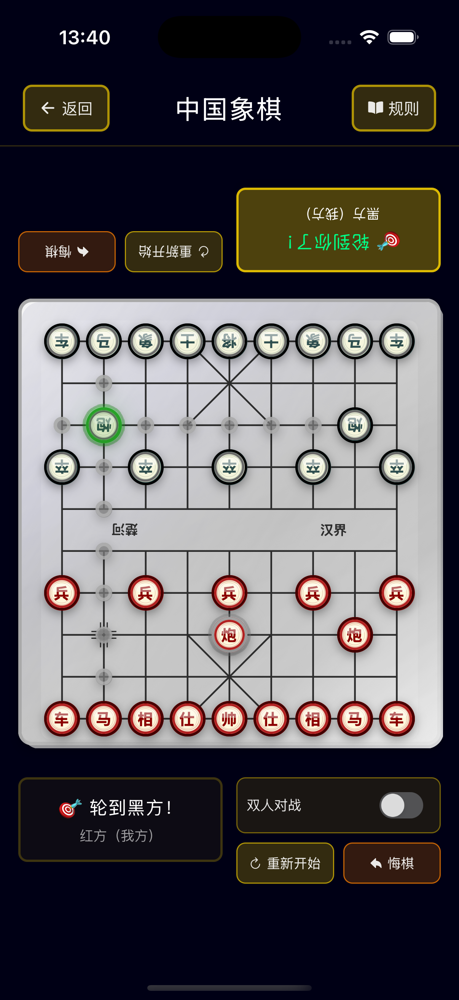

# Board Games - Classic Strategy Games Collection

<div align="center">
  
**English | [中文](./README.md)**

  
</div>

A modern React Native board games application designed for family bonding and interactive gameplay. Experience classic strategy games with a futuristic tech-style interface that combines entertainment with educational value.

## 🎯 Project Features

- **🏠 Family-Friendly Design** - Clean, intuitive interface suitable for all ages
- **🧠 Educational Gaming** - Develops logical thinking, concentration, and patience
- **🎮 Multiple Game Modes** - AI opponents and local multiplayer support
- **🚀 Modern Tech UI** - Cyberpunk-inspired design with neon aesthetics
- **📱 Cross-Platform** - Native performance on iOS, iPad and Android
- **💻 iPad Optimized** - Responsive grid layout and adaptive sizing for tablets
- **⚡ Real-time Gameplay** - Smooth animations and responsive interactions

## 🎮 Available Games

### 🔥 Tic-Tac-Toe


- ✅ Classic 3×3 grid gameplay
- ✅ AI opponent with smart strategy
- ✅ Local multiplayer mode
- ✅ Undo move functionality
- ✅ Game reset option
- ✅ Win/draw detection system

<br clear="right"/>

### 🔴 Checkers


- ✅ Traditional 8×8 board game
- ✅ Strategic piece movement
- ✅ King promotion system
- ✅ Capture mechanics
- ✅ AI difficulty levels
- ✅ Move validation

<br clear="right"/>

### ♟️ Chess


- ✅ Full chess implementation
- ✅ All piece movements
- ✅ Castling and en passant
- ✅ Check and checkmate detection
- ✅ Move history tracking
- ✅ Advanced AI engine

<br clear="right"/>

### ⚫ Gomoku (Five in a Row)


- ✅ 15×15 grid board
- ✅ Five-in-a-row victory
- ✅ Strategic AI opponent
- ✅ Flexible board size
- ✅ Pattern recognition
- ✅ Tournament rules support

<br clear="right"/>

## 🛠️ Tech Stack

- **Frontend**: React Native 0.80
- **UI Framework**: NativeBase 3.4
- **Navigation**: React Navigation 7
- **State Management**: React Hooks
- **Language**: TypeScript
- **Platform**: iOS, iPad & Android
- **Architecture**: Component-based with custom hooks

## 📦 Dependencies

```json
{
  "react": "19.1.0",
  "react-native": "0.80.0",
  "@react-navigation/native": "^7.1.14",
  "native-base": "^3.4.28",
  "react-native-vector-icons": "^10.2.0",
  "react-native-sound": "^0.11.2"
}
```

## 🚀 Getting Started

### Prerequisites

- Node.js 18+ 
- React Native CLI
- Android Studio (for Android)
- Xcode (for iOS, macOS only)

### Installation

1. **Clone the repository**
   ```bash
   git clone <repository-url>
   cd board-games
   ```

2. **Install dependencies**
   ```bash
   npm install
   ```

3. **iOS Setup (macOS only)**
   ```bash
   # Install CocoaPods dependencies
   bundle install
   bundle exec pod install
   ```

### Running the App

#### Android
```bash
npm run android
# or
npx react-native run-android
```

#### iOS
```bash
npm run ios
# or
npx react-native run-ios
```

### Development Scripts

```bash
npm start          # Start Metro bundler
npm run lint       # Run ESLint
npm test          # Run tests
```

## 🎨 Design Philosophy

The application features a cutting-edge cyberpunk aesthetic with:

- **Deep Space Black** (`#000015`) - Creating an immersive tech atmosphere
- **Neon Green Primary** (`#00ff88`) - Futuristic accent color
- **Minimalist Layout** - Focus on core functionality
- **Monospace Typography** - Enhanced programming feel
- **Glow Effects** - Shadows and borders for future-tech ambiance

## 🏗️ Project Structure

```
src/
├── components/     # Reusable UI components
├── screens/        # Screen components
├── navigation/     # Navigation configuration
├── hooks/          # Custom React hooks
├── utils/          # Game logic and utilities
└── types/          # TypeScript type definitions
```

## 🧪 Testing

Run the test suite:

```bash
npm test
```

## 📱 Screenshots Gallery

### iPad Experience
Optimized for tablet devices with responsive grid layout and enhanced touch areas.

| Home Screen | Tic-Tac-Toe | Checkers | Chess | Gomoku |
|-------------|-------------|----------|--------|--------|
|  |  |  |  |  |

### iPhone Experience
Compact design optimized for mobile devices.

| Home Screen | Tic-Tac-Toe | Checkers | Chess | Gomoku |
|-------------|-------------|----------|--------|--------|
|  |  |  |  |  |

## 🤝 Contributing

1. Fork the repository
2. Create a feature branch (`git checkout -b feature/amazing-feature`)
3. Commit your changes (`git commit -m 'Add amazing feature'`)
4. Push to the branch (`git push origin feature/amazing-feature`)
5. Open a Pull Request

## 📄 License

This project is open source and available under the [MIT License](LICENSE).

## 🌟 Future Enhancements

- 🔮 Online multiplayer support
- 🏆 Achievement system
- 📊 Game statistics and analytics
- 🎵 Sound effects and music
- 🌍 Multi-language support
- 🎯 Tutorial and training modes

---

<div align="center">
  <b>🎮 Enjoy playing classic board games with a modern twist! 🚀</b>
</div> 